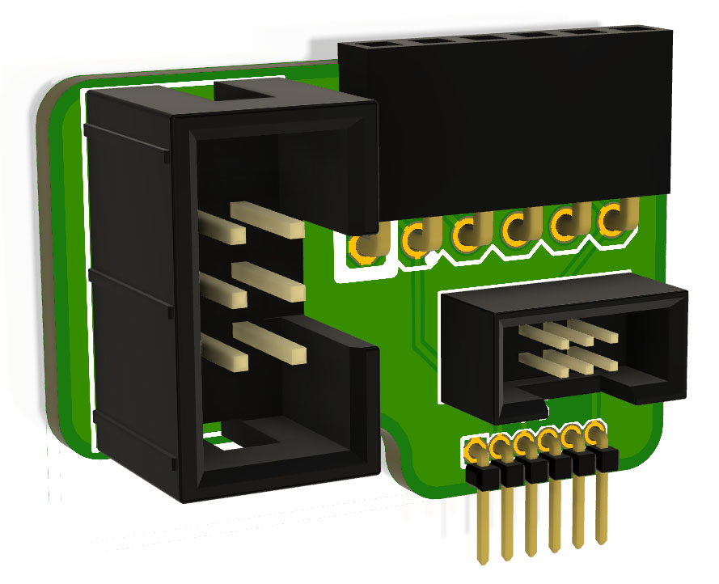

ESPFlasher Adapter
==================

Header adapter that accepts a 1x6 2.54mm ESPFlash header (as used on
the ESPFlasher) and provides matching connections for:

 * 1x6 1.27mm
 * 2x3 2.54mm
 * 2x3 1.27mm

This allows an ESPFlasher to connect to target boards that use these
alternative ESPFlash header formats.

You can view more details at:

  http://www.superhouse.tv/espfa

Credits
-------
 * Jonathan Oxer <jon@oxer.com.au>

License
-------
Copyright 2019-2020 Superhouse Automation Pty Ltd www.superhouse.tv

The hardware portion of this project is licensed under the TAPR Open
Hardware License (www.tapr.org/OHL). The "license" folder within this
repository also contains a copy of this license in plain text format.

The software portion of this project is licensed under the Simplified
BSD License. The "licence" folder within this project contains a capy
of this license in plain text format.
