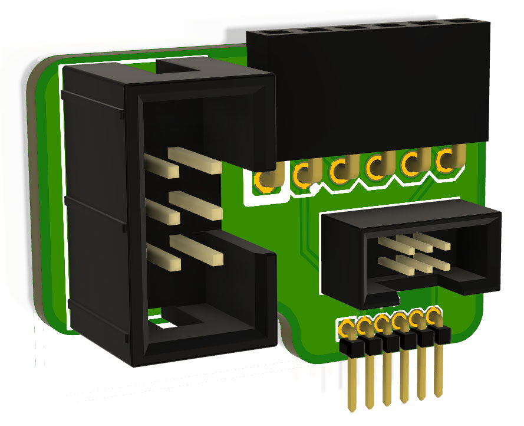

ESPFlasher Adapter
==================
Copyright 2020 SuperHouse Automation Pty Ltd  www.superhouse.tv  

Header adapter that accepts a 1x6 2.54mm ESP-Prog header (as used) on
the ESPFlasher) and provides matching connections for:

 * 1x6 1.27mm
 * 2x3 2.54mm
 * 2x3 1.27mm

This allows an ESPFlasher to connect to target boards that use these
alternative ESP-Prog header formats.

You can view more details at:

  http://www.superhouse.tv/espfa

INSTALLATION
------------
The design is saved as an EAGLE project. EAGLE PCB design software is
available from www.cadsoftusa.com free for non-commercial use. To use
this project download it and place the directory containing these files
into the "eagle" directory on your computer. Then open EAGLE and
navigate to the project.

CREDITS
-------
Jonathan Oxer jon@oxer.com.au

DISTRIBUTION
------------
The specific terms of distribution of this project are governed by the
license referenced below.

LICENSE
-------
Licensed under the TAPR Open Hardware License (www.tapr.org/OHL).
The "license" folder within this repository also contains a copy of
this license in plain text format.
